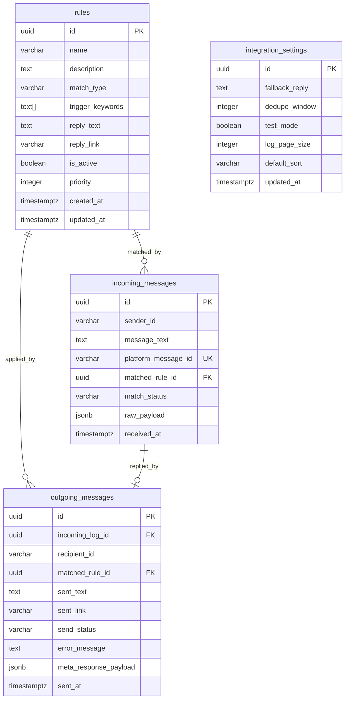

# Instagram DM Auto Reply Admin — ERD (Entity Relationship Diagram)

이 문서는 PRD·IA를 기반으로 Supabase에 구축할 DB의 논리·물리 설계입니다.  
중복 제거, PK/FK 관계, 정규화를 반영했습니다.

---

## 1. 서비스 맥락 요약

| 항목 | 내용 |
|------|------|
| 서비스명 | Instagram DM Auto Reply Admin |
| 핵심 | 규칙 기반 DM 자동응답 + 운영자 관리 콘솔 |
| 아키텍처 | React(로컬) → Supabase DB → Edge Function → Meta API |
| 사용자 | 단일 운영자 (로그인/권한 없음) |

---

## 2. 엔티티 관계 다이어그램 (ERD)

### 2.1 관계 개요

```
┌─────────────────┐
│     rules       │
│  (자동응답 규칙)  │
└────────┬────────┘
         │ 1
         │
         │ N (matched_rule_id)
         │
         ▼
┌─────────────────────┐        1
│ incoming_messages   │ ──────────────┐
│   (수신 메시지 로그)   │             │
└────────┬────────────┘             │
         │ 1                       │ 1
         │                         │
         │ 1                       │ N
         ▼                         ▼
┌─────────────────────┐    ┌─────────────────────┐
│ outgoing_messages   │    │ integration_settings │
│   (발송 메시지 로그)   │    │   (시스템/연동 설정)   │
└─────────────────────┘    └─────────────────────┘
         │
         │ N (matched_rule_id)
         │
         └────────────────────────────► rules
```

### 2.2 상세 ERD (Mermaid)



---

## 3. 테이블 상세 설계

### 3.1 rules (자동응답 규칙)

| 컬럼명 | 타입 | 제약 | 설명 |
|--------|------|------|------|
| id | `uuid` | PK, DEFAULT gen_random_uuid() | 기본 키 |
| name | `varchar(255)` | NOT NULL | 규칙명 |
| description | `text` | | 설명 |
| match_type | `varchar(20)` | NOT NULL, CHECK IN ('contains','exact') | 매칭 방식 |
| trigger_keywords | `text[]` | NOT NULL, array_length ≥ 1 | 트리거 문구 배열 |
| reply_text | `text` | NOT NULL | 응답 텍스트 |
| reply_link | `varchar(2048)` | | 응답 시 첨부 링크 |
| is_active | `boolean` | NOT NULL, DEFAULT true | 활성 여부 |
| priority | `integer` | NOT NULL, DEFAULT 100 | 우선순위 (높을수록 우선) |
| created_at | `timestamptz` | NOT NULL, DEFAULT now() | 생성 시각 |
| updated_at | `timestamptz` | NOT NULL, DEFAULT now() | 수정 시각 |

**인덱스**

- `idx_rules_is_active_priority` ON (is_active, priority DESC) — 활성 규칙 매칭용

---

### 3.2 incoming_messages (수신 메시지 로그)

| 컬럼명 | 타입 | 제약 | 설명 |
|--------|------|------|------|
| id | `uuid` | PK, DEFAULT gen_random_uuid() | 기본 키 |
| sender_id | `varchar(100)` | NOT NULL | Instagram 발신자 ID |
| message_text | `text` | NOT NULL | 메시지 원문 |
| platform_message_id | `varchar(255)` | UNIQUE | Meta 플랫폼 메시지 ID (중복 수신 방지용) |
| matched_rule_id | `uuid` | FK → rules(id) ON DELETE SET NULL | 매칭된 규칙 |
| match_status | `varchar(20)` | NOT NULL, CHECK IN ('matched','unmatched') | 매칭 여부 |
| raw_payload | `jsonb` | | Webhook 원본 payload |
| received_at | `timestamptz` | NOT NULL | 수신 시각 |

**인덱스**

- `idx_incoming_received_at` ON (received_at DESC) — 최근 로그 조회
- `idx_incoming_matched_rule_id` ON (matched_rule_id) — 규칙별 매칭 조회
- UNIQUE (platform_message_id) — dedupe

**FK 동작**

- `matched_rule_id`: ON DELETE SET NULL — 규칙 삭제 시 로그는 보존, 규칙 참조만 null

---

### 3.3 outgoing_messages (발송 메시지 로그)

| 컬럼명 | 타입 | 제약 | 설명 |
|--------|------|------|------|
| id | `uuid` | PK, DEFAULT gen_random_uuid() | 기본 키 |
| incoming_log_id | `uuid` | FK → incoming_messages(id) ON DELETE SET NULL | 원본 수신 로그 |
| recipient_id | `varchar(100)` | NOT NULL | 수신자(발신자) Instagram ID |
| matched_rule_id | `uuid` | FK → rules(id) ON DELETE SET NULL | 적용 규칙 |
| sent_text | `text` | NOT NULL | 실제 발송 텍스트 |
| sent_link | `varchar(2048)` | | 발송 시 포함된 링크 |
| send_status | `varchar(20)` | NOT NULL, CHECK IN ('success','failed') | 발송 상태 |
| error_message | `text` | | 실패 시 에러 메시지 |
| meta_response_payload | `jsonb` | | Meta API 응답 payload |
| sent_at | `timestamptz` | NOT NULL | 발송 시각 |

**인덱스**

- `idx_outgoing_sent_at` ON (sent_at DESC) — 최근 발송 조회
- `idx_outgoing_send_status` ON (send_status) — 성공/실패 필터
- `idx_outgoing_matched_rule_id` ON (matched_rule_id) — 규칙별 발송 조회

**FK 동작**

- `incoming_log_id`: ON DELETE SET NULL — 수신 로그 삭제 시 발송 로그 유지
- `matched_rule_id`: ON DELETE SET NULL — 규칙 삭제 시 로그 유지

---

### 3.4 integration_settings (시스템/연동 설정)

| 컬럼명 | 타입 | 제약 | 설명 |
|--------|------|------|------|
| id | `uuid` | PK, DEFAULT gen_random_uuid() | 기본 키 |
| fallback_reply | `text` | NOT NULL | 미매칭 시 기본 응답 |
| dedupe_window | `integer` | NOT NULL, DEFAULT 60 | 중복 메시지 무시 구간(초) |
| test_mode | `boolean` | NOT NULL, DEFAULT false | 실제 발송 차단 여부 |
| log_page_size | `integer` | NOT NULL, DEFAULT 20 | 로그 페이지당 건수 |
| default_sort | `varchar(50)` | DEFAULT 'created_at_desc' | 기본 정렬 |
| updated_at | `timestamptz` | NOT NULL, DEFAULT now() | 설정 수정 시각 |

**용도**

- 전역 설정 1건만 유지 (단일 행, id 고정 또는 `LIMIT 1` 사용)
- Meta 연동 상태(webhook 수신 시간, 발송 성공/실패)는 `incoming_messages`, `outgoing_messages` 집계로 조회

---

## 4. 설계 결정 사항

### 4.1 중간테이블 미사용 이유

| 후보 | 결정 | 이유 |
|------|------|------|
| rule_keywords | 사용 안 함 | 키워드는 규칙별 독립 배열. `text[]`로 충분하고, 공유·정규화 이점 없음 |
| sender / recipient | 사용 안 함 | Instagram ID만 저장. 사용자 엔티티 없음 |
| message_threads | 사용 안 함 | MVP는 메시지 단위 로그만 필요 |

### 4.2 trigger_keywords를 `text[]`로 둔 이유

- 규칙별로 키워드 집합이 독립적
- “가격” 등이 여러 규칙에 사용되어도, 각 규칙의 의미가 달라 별도 엔티티화 가치 낮음
- 배열 타입이 PostgreSQL에서 기본 지원되고, 조회·인덱싱이 단순함

### 4.3 FK ON DELETE 전략

| FK | 전략 | 이유 |
|----|------|------|
| incoming_messages.matched_rule_id | SET NULL | 규칙 삭제 후에도 수신 로그 보존 |
| outgoing_messages.matched_rule_id | SET NULL | 위와 동일 |
| outgoing_messages.incoming_log_id | SET NULL | 수신 로그 삭제 시에도 발송 로그 보존 (실제 삭제는 거의 없음) |

### 4.4 중복 방지

| 항목 | 방법 |
|------|------|
| 동일 메시지 재처리 | `incoming_messages.platform_message_id` UNIQUE |
| 규칙명 | 애플리케이션 레벨 유니크 권장 (선택) |

---

## 5. 관계 요약

| 관계 | 카디널리티 | FK | 비고 |
|------|------------|----|------|
| rules → incoming_messages | 1 : N | incoming_messages.matched_rule_id | 한 규칙에 여러 수신 매칭 |
| rules → outgoing_messages | 1 : N | outgoing_messages.matched_rule_id | 한 규칙으로 여러 발송 |
| incoming_messages → outgoing_messages | 1 : 0..1 | outgoing_messages.incoming_log_id | 수신 1건당 발송 0~1건 |
| integration_settings | 독립 | - | 단일 설정 테이블 |

---

## 6. Supabase DDL (초기 스키마)

```sql
-- Enum types (optional, can use CHECK instead)
-- CREATE TYPE match_type_enum AS ENUM ('contains', 'exact');
-- CREATE TYPE match_status_enum AS ENUM ('matched', 'unmatched');
-- CREATE TYPE send_status_enum AS ENUM ('success', 'failed');

-- 1. rules
CREATE TABLE rules (
  id uuid PRIMARY KEY DEFAULT gen_random_uuid(),
  name varchar(255) NOT NULL,
  description text,
  match_type varchar(20) NOT NULL CHECK (match_type IN ('contains', 'exact')),
  trigger_keywords text[] NOT NULL,
  reply_text text NOT NULL,
  reply_link varchar(2048),
  is_active boolean NOT NULL DEFAULT true,
  priority integer NOT NULL DEFAULT 100,
  created_at timestamptz NOT NULL DEFAULT now(),
  updated_at timestamptz NOT NULL DEFAULT now(),
  CONSTRAINT trigger_keywords_not_empty CHECK (array_length(trigger_keywords, 1) >= 1)
);

CREATE INDEX idx_rules_is_active_priority ON rules (is_active, priority DESC);

-- 2. incoming_messages
CREATE TABLE incoming_messages (
  id uuid PRIMARY KEY DEFAULT gen_random_uuid(),
  sender_id varchar(100) NOT NULL,
  message_text text NOT NULL,
  platform_message_id varchar(255) UNIQUE,
  matched_rule_id uuid REFERENCES rules(id) ON DELETE SET NULL,
  match_status varchar(20) NOT NULL CHECK (match_status IN ('matched', 'unmatched')),
  raw_payload jsonb,
  received_at timestamptz NOT NULL
);

CREATE INDEX idx_incoming_received_at ON incoming_messages (received_at DESC);
CREATE INDEX idx_incoming_matched_rule_id ON incoming_messages (matched_rule_id);
CREATE INDEX idx_incoming_match_status ON incoming_messages (match_status);

-- 3. outgoing_messages
CREATE TABLE outgoing_messages (
  id uuid PRIMARY KEY DEFAULT gen_random_uuid(),
  incoming_log_id uuid REFERENCES incoming_messages(id) ON DELETE SET NULL,
  recipient_id varchar(100) NOT NULL,
  matched_rule_id uuid REFERENCES rules(id) ON DELETE SET NULL,
  sent_text text NOT NULL,
  sent_link varchar(2048),
  send_status varchar(20) NOT NULL CHECK (send_status IN ('success', 'failed')),
  error_message text,
  meta_response_payload jsonb,
  sent_at timestamptz NOT NULL
);

CREATE INDEX idx_outgoing_sent_at ON outgoing_messages (sent_at DESC);
CREATE INDEX idx_outgoing_send_status ON outgoing_messages (send_status);
CREATE INDEX idx_outgoing_matched_rule_id ON outgoing_messages (matched_rule_id);
CREATE INDEX idx_outgoing_incoming_log_id ON outgoing_messages (incoming_log_id);

-- 4. integration_settings
CREATE TABLE integration_settings (
  id uuid PRIMARY KEY DEFAULT gen_random_uuid(),
  fallback_reply text NOT NULL DEFAULT '문의 감사합니다. 담당자가 확인 후 답변드리겠습니다.',
  dedupe_window integer NOT NULL DEFAULT 60,
  test_mode boolean NOT NULL DEFAULT false,
  log_page_size integer NOT NULL DEFAULT 20,
  default_sort varchar(50) NOT NULL DEFAULT 'created_at_desc',
  updated_at timestamptz NOT NULL DEFAULT now()
);

-- 초기 설정 행 삽입
INSERT INTO integration_settings (fallback_reply, dedupe_window, test_mode, log_page_size, default_sort)
VALUES (
  '문의 감사합니다. 담당자가 확인 후 답변드리겠습니다.',
  60,
  false,
  20,
  'created_at_desc'
);

-- updated_at 자동 갱신 트리거
CREATE OR REPLACE FUNCTION update_updated_at()
RETURNS TRIGGER AS $$
BEGIN
  NEW.updated_at = now();
  RETURN NEW;
END;
$$ LANGUAGE plpgsql;

CREATE TRIGGER rules_updated_at
  BEFORE UPDATE ON rules
  FOR EACH ROW EXECUTE FUNCTION update_updated_at();

CREATE TRIGGER integration_settings_updated_at
  BEFORE UPDATE ON integration_settings
  FOR EACH ROW EXECUTE FUNCTION update_updated_at();
```

---

## 7. 테이블 ↔ IA 매핑

| IA 엔티티 | ERD 테이블 | 비고 |
|-----------|------------|------|
| rules | rules | 동일 |
| incoming_messages | incoming_messages | platform_message_id UNIQUE 추가 |
| outgoing_messages | outgoing_messages | 동일 |
| integration_settings | integration_settings | log_page_size, default_sort 추가 |
