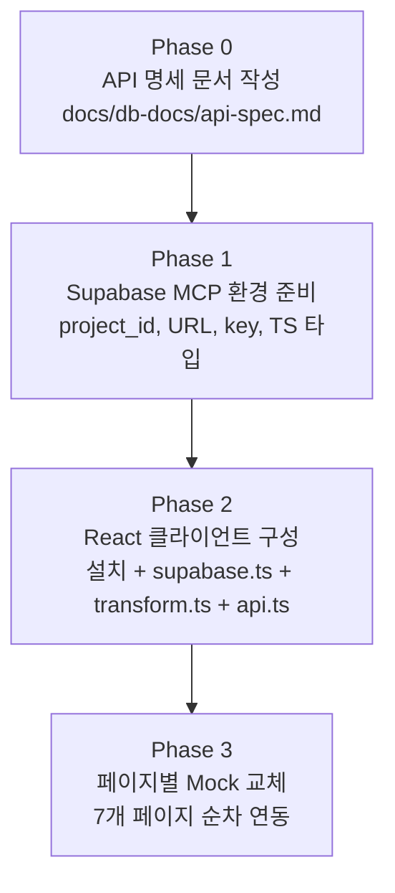

# React-Supabase API 연동 개발 계획 v3

## 현재 상태 요약

| 영역 | 상태 |
|------|------|
| **DB** | [schema.sql](db-docs/schema.sql)로 Supabase에 테이블 생성 완료 |
| **React** | Vite + React 19, 7개 페이지, Mock JSON 사용 중 |
| **Supabase 클라이언트** | 미설치 (`@supabase/supabase-js` 없음) |
| **RLS** | 생략 (혼자 쓰는 로컬 도구) |
| **Settings UI** | 제외 — 7개 페이지 목업 범위 유지. `getSettings()` / `updateSettings()`는 `api.ts` 구현만 |
| **로그 페이지네이션** | 클라이언트 방식 유지 — 전체 데이터 1회 로드 후 클라이언트 필터/페이지네이션 |

---

## 전체 진행 순서



---

## Phase 0: API 명세 문서 작성 (`docs/db-docs/api-spec.md`)

개발 전에 `docs/db-docs/api-spec.md`를 작성합니다. 이 파일은 `src/lib/api.ts`에서 구현할 함수 명세입니다.

### 0-1. 공통 타입 (DB → React 변환 후)

```typescript
// Rule (rules 테이블)
interface Rule {
  id: string
  name: string
  description: string | null
  matchType: 'contains' | 'exact'
  triggerKeywords: string[]
  replyText: string
  replyLink: string | null
  isActive: boolean
  priority: number
  createdAt: string
  updatedAt: string
}

// IncomingMessage (incoming_messages 테이블)
interface IncomingMessage {
  id: string
  senderId: string
  messageText: string
  platformMessageId: string | null
  matchedRuleId: string | null
  matchedRuleName: string | null   // rules JOIN
  matchStatus: 'matched' | 'unmatched'
  rawPayload: unknown | null
  receivedAt: string
}

// OutgoingMessage (outgoing_messages 테이블)
interface OutgoingMessage {
  id: string
  incomingLogId: string | null
  recipientId: string
  matchedRuleId: string | null
  matchedRuleName: string | null   // rules JOIN
  originalMessage: string | null   // incoming_messages JOIN
  sentText: string
  sentLink: string | null
  sendStatus: 'success' | 'failed'
  errorMessage: string | null
  metaResponsePayload: unknown | null
  sentAt: string
}

// IntegrationSettings (integration_settings 테이블)
interface IntegrationSettings {
  id: string
  fallbackReply: string
  dedupeWindow: number
  testMode: boolean
  logPageSize: number
  defaultSort: string
  updatedAt: string
}
```

### 0-2. API 함수 명세 전체 (`src/lib/api.ts` 구현 대상)

#### Dashboard

| 함수 | 설명 | Supabase 쿼리 대상 | 반환 타입 |
|------|------|-------------------|-----------|
| `getDashboardKpis()` | KPI 4종 집계 (Promise.all 병렬) | rules(count), incoming_messages(count), outgoing_messages(count) | `DashboardKpis` |
| `getRecentIncoming(limit?)` | 최근 수신 메시지 목록 | incoming_messages + rules JOIN | `IncomingMessage[]` |
| `getRecentFailures(limit?)` | 최근 발송 실패 목록 | outgoing_messages(failed) + rules JOIN | `OutgoingMessage[]` |

```typescript
interface DashboardKpis {
  totalRules: number
  activeRules: number
  todayIncoming: number
  todayOutgoingSuccess: number
}
```

#### Rules

| 함수 | 설명 | 반환 타입 |
|------|------|-----------|
| `getRules()` | 전체 목록 조회 (클라이언트 필터/페이지네이션용 전체 반환) | `Rule[]` |
| `getRuleById(id)` | 단건 조회 | `Rule` |
| `createRule(payload)` | 규칙 생성 | `Rule` |
| `updateRule(id, payload)` | 전체 수정 | `Rule` |
| `toggleRule(id, isActive)` | 활성 토글 | `Pick<Rule, 'id' \| 'isActive' \| 'updatedAt'>` |
| `deleteRule(id)` | 삭제 | `void` |
| `getRuleMatches(id, limit?)` | 규칙에 매칭된 수신 로그 | `IncomingMessage[]` |

`createRule` / `updateRule` payload:

```typescript
interface RulePayload {
  name: string                       // 필수
  description?: string | null
  matchType: 'contains' | 'exact'   // 필수
  triggerKeywords: string[]          // 필수, 최소 1개
  replyText: string                  // 필수
  replyLink?: string | null
  isActive?: boolean                 // 기본 true
  priority?: number                  // 기본 100
}
```

> `getRules()`는 전체를 한 번에 반환. 검색/필터/페이지네이션은 기존 `RulesPage.tsx`의 클라이언트 로직 그대로 유지.

#### Logs

| 함수 | 설명 | 반환 타입 |
|------|------|-----------|
| `getIncomingLogs()` | 수신 로그 전체 조회 (클라이언트 필터/페이지네이션용) | `IncomingMessage[]` |
| `getOutgoingLogs()` | 발송 로그 전체 조회 (클라이언트 필터/페이지네이션용) | `OutgoingMessage[]` |

> 기존 `IncomingLogsPage.tsx` / `OutgoingLogsPage.tsx`의 `useMemo` 필터, 페이지네이션 로직을 그대로 유지.
> 반환값이 배열이므로 기존 `setLogs(items)` 패턴과 호환됩니다.

#### Test

| 함수 | 설명 | 반환 타입 |
|------|------|-----------|
| `getActiveRules()` | 활성 규칙 전체 조회 (클라이언트 매칭용) | `Rule[]` |

> `TestPage.tsx`의 `matchRules()` 함수는 `keywords` 대신 `triggerKeywords` 필드로 수정.

#### Settings (UI 페이지 없음 — api.ts 구현만)

| 함수 | 설명 | 반환 타입 |
|------|------|-----------|
| `getSettings()` | 시스템 설정 조회 | `IntegrationSettings` |
| `updateSettings(payload)` | 시스템 설정 수정 | `IntegrationSettings` |

> Settings 페이지는 frontend-mockup-prompt.md MVP 범위 밖. 함수만 구현해두고 Phase 3에서 호출 없음.

---

## Phase 1: Supabase MCP 환경 준비

### 1.1 프로젝트 ID 확인

- `list_projects` → `project_id` 확인

### 1.2 URL & 키 조회 → `.env.local` 작성

- `get_project_url`(project_id) + `get_publishable_keys`(project_id)

```
VITE_SUPABASE_URL=https://<project-ref>.supabase.co
VITE_SUPABASE_ANON_KEY=<anon_key>
```

### 1.3 TypeScript 타입 생성

- `generate_typescript_types`(project_id) → `src/types/database.types.ts`

---

## Phase 2: React 클라이언트 레이어 구성

### 2.1 패키지 설치

```bash
npm install @supabase/supabase-js
```

### 2.2 Vite 환경 변수 타입 선언

`src/vite-env.d.ts`에 추가 (기존 파일이 있으면 병합):

```typescript
interface ImportMetaEnv {
  readonly VITE_SUPABASE_URL: string
  readonly VITE_SUPABASE_ANON_KEY: string
}

interface ImportMeta {
  readonly env: ImportMetaEnv
}
```

### 2.3 `src/lib/supabase.ts`

```typescript
import { createClient } from '@supabase/supabase-js'
import type { Database } from '@/types/database.types'

export const supabase = createClient<Database>(
  import.meta.env.VITE_SUPABASE_URL,
  import.meta.env.VITE_SUPABASE_ANON_KEY,
)
```

### 2.4 `src/lib/transform.ts`

DB `snake_case` → React `camelCase` 변환. 주요 처리 포인트:

- `toRule(row)` — `trigger_keywords` → `triggerKeywords`, **`keywordCount`는 `triggerKeywords.length`로 파생**
- `toIncomingMessage(row)` — `received_at` → `receivedAt`. **`RuleDetailPage`에서 사용하는 `matchedAt`은 `receivedAt`으로 통일** (컴포넌트 내 `matchedAt` 참조 제거)
- `toOutgoingMessage(row)` — `rules(name)` JOIN 결과 → `matchedRuleName`, `incoming_messages(message_text)` JOIN → `originalMessage`
- `toIntegrationSettings(row)` — `fallback_reply`, `dedupe_window`, `test_mode` 등 변환

### 2.5 `src/lib/api.ts`

Phase 0 명세 기반으로 구현. 각 함수:

1. `supabase.from(...)` 쿼리 실행
2. 에러 시 `throw new Error(error.message)`
3. 성공 시 `transform.ts`로 변환 후 반환

---

## Phase 3: 페이지별 Mock → Supabase 교체

각 페이지에서 `fetch('/data/routes/*.json')`를 `api.ts` 호출로 교체.
기존 로딩/에러/빈 상태(State machine) 구조는 그대로 유지.

| 페이지 | 기존 fetch | 교체 api 함수 | 특이사항 |
|--------|-----------|--------------|---------|
| `DashboardPage.tsx` | `dashboard.json` | `getDashboardKpis()`, `getRecentIncoming()`, `getRecentFailures()` | Promise.all 병렬 호출 |
| `RulesPage.tsx` | `rules.json` | `getRules()` + `toggleRule()` | 전체 로드 후 기존 클라이언트 필터/페이지네이션 유지 |
| `RuleNewPage.tsx` | `rule-new.json` (form defaults만) | `createRule()` | `matchTypeOptions` 하드코딩으로 교체. Mock fetch 완전 제거 |
| `RuleDetailPage.tsx` | `rule-detail.json` | `getRuleById(ruleId)`, `getRuleMatches(ruleId)`, `updateRule()`, `toggleRule()`, `deleteRule()` | `ruleId` useParams 실제 사용. `recentMatches`의 `matchedAt` → `receivedAt`으로 통일 |
| `IncomingLogsPage.tsx` | `logs-incoming.json` | `getIncomingLogs()` | 전체 로드 후 기존 `useMemo` 필터/페이지네이션 유지 |
| `OutgoingLogsPage.tsx` | `logs-outgoing.json` | `getOutgoingLogs()` | 전체 로드 후 기존 `useMemo` 필터/페이지네이션 유지 |
| `TestPage.tsx` | `test.json` (mockRules만) | `getActiveRules()` | `matchRules()`의 `rule.keywords` → `rule.triggerKeywords`로 수정 |

---

## 수정/추가할 파일 목록

| 작업 | 경로 | 비고 |
|------|------|------|
| 신규 생성 | `docs/db-docs/api-spec.md` | Phase 0 — 개발 전 작성 |
| 추가 | `.env.local` | Supabase URL, anon key |
| 추가 | `src/types/database.types.ts` | MCP generate_typescript_types 자동 생성 |
| 수정 | `src/vite-env.d.ts` | ImportMetaEnv 타입 선언 추가 |
| 추가 | `src/lib/supabase.ts` | createClient 초기화 |
| 추가 | `src/lib/transform.ts` | snake_case → camelCase, keywordCount 파생, matchedAt→receivedAt |
| 추가 | `src/lib/api.ts` | 전체 API 함수 구현 (Settings 포함) |
| 수정 | `src/pages/DashboardPage.tsx` | Mock → Supabase |
| 수정 | `src/pages/RulesPage.tsx` | Mock → Supabase |
| 수정 | `src/pages/RuleNewPage.tsx` | Mock → Supabase, matchTypeOptions 하드코딩 |
| 수정 | `src/pages/RuleDetailPage.tsx` | ruleId 실사용, matchedAt→receivedAt |
| 수정 | `src/pages/IncomingLogsPage.tsx` | Mock → Supabase, 클라이언트 페이지네이션 유지 |
| 수정 | `src/pages/OutgoingLogsPage.tsx` | Mock → Supabase, 클라이언트 페이지네이션 유지 |
| 수정 | `src/pages/TestPage.tsx` | getActiveRules(), keywords→triggerKeywords |
| 수정 | `package.json` | @supabase/supabase-js 추가 |
| 정리 | `public/data/routes/*.json` | Mock 파일 삭제 |

---

## 네이밍/코딩 규칙

- DB 필드: `snake_case` 유지 (`database.types.ts` 기준)
- React 타입/상태/props: `camelCase`
- `transform.ts`에서 일괄 변환 (한 곳에서만 처리)
- 에러 처리: `toast.error()` + `console.error` (기존 sonner 활용)
- `api.ts` 함수는 에러를 throw — 페이지에서 try/catch

---

## 검토 완료된 이슈 목록

이전 계획 검토에서 발견된 문제들과 대응 방향:

| # | 문제 | 대응 |
|---|------|------|
| 1 | `RulesPage`의 `keywordCount` DB에 없음 | `transform.ts`의 `toRule()`에서 `triggerKeywords.length`로 파생 |
| 2 | `RuleDetailPage`의 `matchedAt` DB에 없음 | `toIncomingMessage()`에서 `received_at → receivedAt`만 사용. 컴포넌트의 `matchedAt` 참조 제거 |
| 3 | `TestPage` `keywords` vs `triggerKeywords` 불일치 | `matchRules()`에서 `rule.keywords` → `rule.triggerKeywords`로 수정 |
| 4 | Vite 환경 변수 타입 선언 누락 | `src/vite-env.d.ts`에 `ImportMetaEnv` 추가 |
| 5 | 로그 페이지네이션 전략 | 클라이언트 방식 유지 — 기존 `useMemo` 필터/페이지네이션 그대로 |
| 6 | Settings 페이지 없음 | UI 페이지 생성 안 함. `api.ts`에 `getSettings()` / `updateSettings()` 구현만 |
| 7 | `RuleNewPage` `matchTypeOptions` Mock JSON에서 로드 | 하드코딩 상수로 교체 |

---

## 체크리스트

- [ ] `docs/db-docs/api-spec.md` 작성 완료
- [ ] Supabase project_id 확인 및 `.env.local` 설정
- [ ] `src/types/database.types.ts` MCP 생성
- [ ] `@supabase/supabase-js` 설치
- [ ] `src/vite-env.d.ts` 환경 변수 타입 선언
- [ ] `src/lib/supabase.ts` 초기화
- [ ] `src/lib/transform.ts` 구현 (keywordCount 파생, matchedAt→receivedAt 포함)
- [ ] `src/lib/api.ts` 전체 함수 구현 (Settings API 포함)
- [ ] DashboardPage 실데이터 교체 (Promise.all)
- [ ] RulesPage 전체 로드 + 클라이언트 필터/페이지네이션 유지
- [ ] RuleNewPage createRule() 연동 + matchTypeOptions 하드코딩
- [ ] RuleDetailPage ruleId 실사용 + matchedAt→receivedAt
- [ ] IncomingLogsPage 전체 로드 + 기존 클라이언트 로직 유지
- [ ] OutgoingLogsPage 전체 로드 + 기존 클라이언트 로직 유지
- [ ] TestPage getActiveRules() + triggerKeywords 수정
- [ ] `public/data/routes/*.json` Mock 파일 정리
